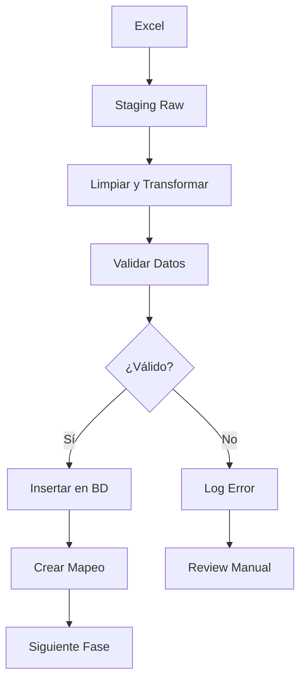

# MAPEO DE DATOS - MIGRACIÓN COMPLETA

**Fecha**: 2026-08-02  
**Objetivo**: Definir transformaciones exactas de Excel → PostgreSQL

---

## ARCHIVO 1: BASEDATOS CRELEALTAD (1) (1).xlsx

### HOJA: Hoja1 (8,407 registros)

#### Mapeo columna por columna:

| # | Col Excel | Encabezado | Ejemplo | → Tabla BD | Campo BD | Transformación |
|---|-----------|------------|---------|------------|----------|----------------|
| 1 | A | NOMBRE | "GABINA BERNAL LOPEZ" | `personas` | `primer_nombre` | Parsear: tomar primera palabra |
|   |   |   |   | `personas` | `segundo_nombre` | Parsear: si hay 4 palabras, tomar segunda |
|   |   |   |   | `personas` | `apellido_pat` | Parsear: penúltima palabra |
|   |   |   |   | `personas` | `apellido_mat` | Parsear: última palabra |
| 2 | B | CURP | "BELG600218MNLRPB00" | `personas` | `curp` | Directo (mayúsculas, trim) |
|   |   |   |   | `personas` | `fecha_nac` | Extraer posiciones 5-10 → AAMMDD → DATE |
|   |   |   |   | `personas` | `genero` | Extraer posición 11: H→MASCULINO, M→FEMENINO |
| 3 | C | TELEFONO | "8126473334" | `personas` | `telefono` | Limpiar: quitar espacios, guiones, paréntesis |
| 4 | D | DIRECCION | "18 DE ENERO #105..." | `personas` | `direccion_completa` | Directo (TEXT) |
| 5 | E | GRUPO | "GABINAS VIP" | `grupos` | `nombre` | Normalizar: UPPER, TRIM |
|   |   |   |   | MAPEO | - | Guardar: nombre → uuid |
| 6 | F | CICLO | "1" | `integrantes` | `ciclo` | INT directo |
| 7 | G | MONTO | "$15,000.00" | `personas` | `monto_solicitado` | Quitar "$", ",", espacios → DECIMAL |
| 8 | H | LUPITA | "ANGEL" | `expedientes` | `asesora_id` | Buscar UUID en tabla usuarios por nombre |
| 9 | I | PAPELERIA COMP. | "SI" | `integrantes` | `estado` | SI→"DOCUMENTADO", otro→"DOCUMENTANDO" |

---

## TRANSFORMACIONES DETALLADAS

### 1. PARSEAR NOMBRE COMPLETO

**Input**: `"GABINA BERNAL LOPEZ"`  
**Output**:
```json
{
  "primer_nombre": "GABINA",
  "segundo_nombre": null,
  "apellido_pat": "BERNAL",
  "apellido_mat": "LOPEZ"
}
```

**Algoritmo**:
```javascript
function parsearNombre(nombreCompleto) {
  const partes = nombreCompleto.trim().toUpperCase().split(/\s+/);
  
  if (partes.length === 2) {
    // Solo nombre + apellido (raro)
    return {
      primer_nombre: partes[0],
      segundo_nombre: null,
      apellido_pat: partes[1],
      apellido_mat: null
    };
  }
  
  if (partes.length === 3) {
    // Nombre + apellido_pat + apellido_mat (más común)
    return {
      primer_nombre: partes[0],
      segundo_nombre: null,
      apellido_pat: partes[1],
      apellido_mat: partes[2]
    };
  }
  
  if (partes.length === 4) {
    // Primer_nombre + segundo_nombre + apellido_pat + apellido_mat
    return {
      primer_nombre: partes[0],
      segundo_nombre: partes[1],
      apellido_pat: partes[2],
      apellido_mat: partes[3]
    };
  }
  
  // Más de 4 palabras (casos especiales)
  return {
    primer_nombre: partes[0],
    segundo_nombre: partes.slice(1, -2).join(' '),
    apellido_pat: partes[partes.length - 2],
    apellido_mat: partes[partes.length - 1]
  };
}
```

**Casos especiales**:
- `"MARIA DE LOS ANGELES GARCIA LOPEZ"` → `{primer: "MARIA", segundo: "DE LOS ANGELES", apellido_pat: "GARCIA", apellido_mat: "LOPEZ"}`
- `"JUAN PABLO MARTINEZ"` → `{primer: "JUAN", segundo: "PABLO", apellido_pat: "MARTINEZ", apellido_mat: null}` ❌ **REVISAR**

---

### 2. EXTRAER DATOS DE CURP

**Input**: `"BELG600218MNLRPB00"`

**Estructura CURP**:
```
B  E  L  G  6  0  0  2  1  8  M  N  L  R  P  B  0  0
1  2  3  4  5  6  7  8  9 10 11 12 13 14 15 16 17 18

Posiciones:
1-4:  Apellidos e inicial nombre
5-10: Fecha nacimiento (AAMMDD)
11:   Sexo (H=Hombre, M=Mujer)
12-13: Estado nacimiento
14-16: Consonantes internas
17-18: Dígito verificador
```

**Algoritmo**:
```javascript
function extraerDatosCURP(curp) {
  // Validar longitud
  if (curp.length !== 18) {
    throw new Error(`CURP inválido: longitud ${curp.length}, esperada 18`);
  }
  
  // Extraer fecha (posiciones 5-10, índice 4-9)
  const año = curp.substring(4, 6);   // "60"
  const mes = curp.substring(6, 8);   // "02"
  const dia = curp.substring(8, 10);  // "18"
  
  // Determinar siglo
  // 00-30 → año 2000+
  // 31-99 → año 1900+
  const añoNum = parseInt(año);
  const añoCompleto = añoNum <= 30 ? `20${año}` : `19${año}`;
  
  // Extraer género (posición 11, índice 10)
  const letraGenero = curp.charAt(10);  // "M"
  const genero = letraGenero === 'H' ? 'MASCULINO' : 'FEMENINO';
  
  return {
    fecha_nac: `${añoCompleto}-${mes}-${dia}`,  // "1960-02-18"
    genero: genero                               // "FEMENINO"
  };
}
```

**Validación**:
```javascript
function validarCURP(curp) {
  // Longitud
  if (curp.length !== 18) return false;
  
  // Formato general
  const regex = /^[A-Z]{4}\d{6}[HM][A-Z]{5}[0-9A-Z]\d$/;
  if (!regex.test(curp)) return false;
  
  // Validar fecha
  const año = parseInt(curp.substring(4, 6));
  const mes = parseInt(curp.substring(6, 8));
  const dia = parseInt(curp.substring(8, 10));
  
  if (mes < 1 || mes > 12) return false;
  if (dia < 1 || dia > 31) return false;
  
  return true;
}
```

---

### 3. LIMPIAR TELÉFONO

**Input**: `"8126473334"`, `"812-647-3334"`, `"(812) 647-3334"`, `"812 647 3334"`

**Algoritmo**:
```javascript
function limpiarTelefono(telefono) {
  if (!telefono) return null;
  
  // Quitar todo excepto dígitos
  const soloDigitos = telefono.replace(/\D/g, '');
  
  // Validar longitud (México: 10 dígitos)
  if (soloDigitos.length === 10) {
    return soloDigitos;
  }
  
  // Si tiene 11 o 12 dígitos, quitar prefijos internacionales
  if (soloDigitos.length === 11 && soloDigitos.startsWith('1')) {
    return soloDigitos.substring(1);  // Quitar 1 de prefijo USA
  }
  
  if (soloDigitos.length === 12 && soloDigitos.startsWith('52')) {
    return soloDigitos.substring(2);  // Quitar 52 de prefijo México
  }
  
  // Longitud inválida
  if (soloDigitos.length < 10) {
    return null;  // Teléfono inválido
  }
  
  // Más de 12 dígitos, tomar últimos 10
  return soloDigitos.slice(-10);
}
```

**Output**: `"8126473334"`

---

### 4. CONVERTIR MONTO

**Input**: `"$15,000.00"`, `"$ 8,000.00"`, `"$10,000"`

**Algoritmo**:
```javascript
function convertirMonto(montoTexto) {
  if (!montoTexto) return null;
  
  // Quitar $, comas, espacios
  const limpio = montoTexto
    .replace(/\$/g, '')
    .replace(/,/g, '')
    .trim();
  
  // Convertir a número
  const numero = parseFloat(limpio);
  
  // Validar
  if (isNaN(numero) || numero <= 0) {
    return null;
  }
  
  // Redondear a 2 decimales
  return Math.round(numero * 100) / 100;
}
```

**Output**: `15000.00` (DECIMAL)

---

### 5. NORMALIZAR NOMBRE DE GRUPO

**Input**: `"gabinas vip "`, `"  GABINAS VIP"`, `"Gabinas  VIP"`

**Algoritmo**:
```javascript
function normalizarGrupo(nombreGrupo) {
  if (!nombreGrupo) return null;
  
  return nombreGrupo
    .trim()
    .toUpperCase()
    .replace(/\s+/g, ' ');  // Reemplazar múltiples espacios por uno
}
```

**Output**: `"GABINAS VIP"`

---

### 6. MAPEAR ESTADO DE PAPELERÍA

**Input**: `"SI"`, `"NO"`, `""`, `null`

**Algoritmo**:
```javascript
function mapearEstadoPapeleria(papeleriaComp) {
  if (!papeleriaComp) return 'DOCUMENTANDO';
  
  const valor = papeleriaComp.trim().toUpperCase();
  
  if (valor === 'SI' || valor === 'SÍ' || valor === 'S') {
    return 'DOCUMENTADO';
  }
  
  return 'DOCUMENTANDO';
}
```

**Output**: `"DOCUMENTADO"` o `"DOCUMENTANDO"`

---

## ARCHIVO 2: BASE DE DATOS SEM 364.xlsm

### HOJA: BASE DE DATOS

#### Mapeo de columnas financieras:

| Col Excel | Encabezado | Ejemplo | → Tabla BD | Campo BD | Transformación |
|-----------|------------|---------|------------|----------|----------------|
| C | # GPO | "123" | `grupos` | `folio_legacy` | Directo (VARCHAR) |
| D | CICLO | "1" | `creditos` | - | Vincular expediente por grupo+ciclo |
| E | NOMBRE GRUPO | "GABINAS VIP" | MAPEO | - | Buscar grupo_uuid |
| J | FECHA DE DESEMBOLSO | "01/15/2024" | `creditos` | `fecha_desembolso` | Convertir Excel serial → DATE |
| K | SEMANA DESEMBOLSO | "364" | `creditos` | `semana_desembolso` | INT directo |
| L | TASA | "18" | `creditos` | `tasa` | INT directo |
| M | RETENCION INICIAL | "500" | `creditos` | `retencion_inicial` | Convertir a DECIMAL |
| N | APERTURA | "200" | `creditos` | `costo_apertura` | Convertir a DECIMAL |
| P | PLAZO | "16" | `creditos` | `plazo_semanas` | INT directo |
| R | PRESTAMO | "120000" | `creditos` | `monto_prestamo` | Convertir a DECIMAL |
| T | TOTAL DE LA CUENTA | "150000" | `creditos` | `monto_total` | Convertir a DECIMAL |
| U | SEM VENCIMIENTO | "380" | `creditos` | `semana_vencimiento` | INT directo |
| V | FECHA VENCIMIENTO | "05/15/2024" | `creditos` | `fecha_vencimiento` | Convertir Excel serial → DATE |
| Y | PAGO MINIMO | "9375" | `creditos` | `pago_semanal` | Convertir a DECIMAL |
| AC | TOTAL PAGADO | "75000" | `creditos` | `total_pagado` | Convertir a DECIMAL |
| AU | SALDO X LIQUIDAR | "75000" | `creditos` | `saldo_pendiente` | Convertir a DECIMAL |

---

## TABLAS DE MAPEO (RUNTIME)

### 1. Mapeo Grupos

**Archivo**: `data/mapeo/grupos_legacy_to_uuid.json`

```json
{
  "GABINAS VIP": "550e8400-e29b-41d4-a716-446655440001",
  "VALLE SUR": "550e8400-e29b-41d4-a716-446655440002",
  "REYNAS": "550e8400-e29b-41d4-a716-446655440003"
}
```

### 2. Mapeo Personas

**Archivo**: `data/mapeo/personas_curp_to_uuid.json`

```json
{
  "BELG600218MNLRPB00": "650e8400-e29b-41d4-a716-446655440001",
  "RABV890711HNLMRC04": "650e8400-e29b-41d4-a716-446655440002"
}
```

### 3. Mapeo Expedientes

**Archivo**: `data/mapeo/expedientes_grupo_to_uuid.json`

```json
{
  "550e8400-e29b-41d4-a716-446655440001": "750e8400-e29b-41d4-a716-446655440001"
}
```

### 4. Mapeo Asesoras

**Creado manualmente o desde tabla usuarios**:

```json
{
  "HILDA": "850e8400-e29b-41d4-a716-446655440001",
  "ANGEL": "850e8400-e29b-41d4-a716-446655440002",
  "ELI": "850e8400-e29b-41d4-a716-446655440003",
  "LUPITA": "850e8400-e29b-41d4-a716-446655440004",
  "ANA VAZ": "850e8400-e29b-41d4-a716-446655440005",
  "JULIETA": "850e8400-e29b-41d4-a716-446655440006",
  "VICKY": "850e8400-e29b-41d4-a716-446655440007"
}
```

---

## REGLAS DE VALIDACIÓN

### Personas

```javascript
const validacionPersona = {
  curp: {
    required: true,
    length: 18,
    pattern: /^[A-Z]{4}\d{6}[HM][A-Z]{5}[0-9A-Z]\d$/,
    unique: true
  },
  primer_nombre: {
    required: true,
    maxLength: 50
  },
  apellido_pat: {
    required: true,
    maxLength: 50
  },
  telefono: {
    required: false,
    length: 10,
    pattern: /^\d{10}$/
  },
  monto_solicitado: {
    required: false,
    min: 0,
    max: 999999.99
  },
  fecha_nac: {
    required: false,
    min: new Date('1920-01-01'),
    max: new Date()
  }
};
```

### Grupos

```javascript
const validacionGrupo = {
  nombre: {
    required: true,
    maxLength: 255,
    unique: true
  }
};
```

### Integrantes

```javascript
const validacionIntegrante = {
  persona_id: {
    required: true,
    exists: 'personas.id'
  },
  expediente_id: {
    required: true,
    exists: 'expedientes.id'
  },
  ciclo: {
    required: false,
    min: 1,
    max: 100
  }
};
```

---

## CASOS ESPECIALES

### 1. Personas sin teléfono
- **Acción**: Insertar con `telefono = NULL`
- **Log**: Advertencia, no error

### 2. Nombres con caracteres especiales
```javascript
// Ejemplo: "MARÍA JOSÉ"
// Normalizar: quitar acentos
function quitarAcentos(texto) {
  return texto
    .normalize('NFD')
    .replace(/[̀-ͯ]/g, '');
}
// Output: "MARIA JOSE"
```

### 3. CURP duplicados
- **Acción**: Usar el primero, loguear duplicados
- **Tabla**: `staging.personas_raw` con flag `duplicado = TRUE`

### 4. Grupos sin asesora
- **Acción**: `expedientes.asesora_id = NULL`
- **Log**: Advertencia

### 5. Integrantes sin persona (CURP no encontrado)
- **Acción**: Crear persona nueva con datos mínimos
- **Log**: Advertencia + review manual

---

## ORDEN DE PROCESAMIENTO



---

**Última actualización**: 2026-08-02  
**Versión**: 1.0  
