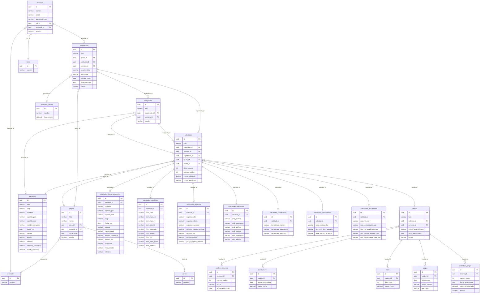

# FLUJO DE DATOS - CRELEALTAD CORE

Mapa completo del flujo operativo del sistema. Todo con evidencia de archivo y línea.

---

## A) ENTIDADES DEL SISTEMA

### usuarios
**QUÉ REPRESENTA**: Usuario del sistema (asesora, administrador, jefe, tesorera).
**QUIÉN LA CREA**: Administrador del sistema.
**PANTALLA**: PENDIENTE DE DEFINIR (no hay controller usuarios en backend actual).
**EVENTO DE NACIMIENTO**: Registro manual por admin.
**DEPENDENCIAS**: rol_id (tabla roles), sucursal_id (tabla sucursales).
**QUÉ SE ROMPE SIN ELLA**: No hay autenticación ni autorización en el sistema.
**MUTABILIDAD**: Se actualiza. Campos: nombre, email, rol_id, sucursal_id, estado,
ultimo_login. Estados: ACTIVO, INACTIVO, SUSPENDIDO (usuario.entity.ts:6-7).

**EVIDENCIA**:
- apps/api/src/catalogos/entities/usuario.entity.ts:9-40
- apps/api/src/auth/auth.controller.ts (existe pero sin endpoints CRUD de usuarios)

---

### grupos
**QUÉ REPRESENTA**: Grupo solidario de clientas que solicitan crédito grupal.
**QUIÉN LA CREA**: Asesora de campo.
**PANTALLA**: Crear Grupo (mobile PENDIENTE DE VERIFICAR).
**EVENTO DE NACIMIENTO**: Cuando una asesora inicia la formación de un grupo nuevo.
**DEPENDENCIAS**: zona_id (opcional), sucursal_id (opcional), created_by (usuario).
**QUÉ SE ROMPE SIN ELLA**: No puede haber expedientes ni integrantes.
**MUTABILIDAD**: Se actualiza. Campos: nombre, zona_id, sucursal_id, fecha_inicio,
estado. Estados: FORMANDO (default), ACTIVO, EN_RENOVACION, LIQUIDADO, INACTIVO
(grupo.entity.ts:4-10).

**EVIDENCIA**:
- apps/api/src/grupos/grupo.entity.ts:13-50
- apps/api/src/grupos/grupos.controller.ts:11-14 (POST /grupos)
- apps/api/src/grupos/dto/create-grupo.dto.ts

---

### expedientes
**QUÉ REPRESENTA**: Expediente de solicitud grupal que contiene integrantes.
**QUIÉN LA CREA**: Asesora de campo.
**PANTALLA**: Crear Expediente (mobile PENDIENTE DE VERIFICAR).
**EVENTO DE NACIMIENTO**: Cuando una asesora abre un expediente para un grupo.
**DEPENDENCIAS**: grupo_id (obligatorio), producto_id (opcional), asesora_id (opcional).
**QUÉ SE ROMPE SIN ELLA**: No puede haber integrantes ni solicitudes.
**MUTABILIDAD**: Se actualiza. Campos: grupo_id, producto_id, asesora_id,
horario_visita, dias_visita, semana_cobro, observaciones, estado, estado_fecha.
Estados: EN_DOCUMENTACION (default), EN_VERIFICACION, COMPLETO, EN_REVISION,
AUTORIZADO, RECHAZADO, DESEMBOLSADO (expediente.entity.ts:4-12).

**EVIDENCIA**:
- apps/api/src/expedientes/expediente.entity.ts:14-61
- apps/api/src/expedientes/expedientes.controller.ts:10-13 (POST /expedientes)
- apps/api/src/expedientes/dto/create-expediente.dto.ts
- apps/api/src/expedientes/expedientes.controller.ts:35-42 (PATCH :id/send-to-verification)

---

### integrantes
**QUÉ REPRESENTA**: Integrante (solicitante) de un expediente.
**QUIÉN LA CREA**: Asesora de campo.
**PANTALLA**: Agregar Integrante al Expediente (mobile PENDIENTE DE VERIFICAR).
**EVENTO DE NACIMIENTO**: Cuando la asesora agrega una clienta al expediente.
**DEPENDENCIAS**: expediente_id (obligatorio), persona_id (opcional - se crea persona
si no existe).
**QUÉ SE ROMPE SIN ELLA**: No puede haber solicitud asociada.
**MUTABILIDAD**: Se actualiza. Campos: expediente_id, persona_id, estado. Estados:
DOCUMENTANDO (default), SUJETA_CREDITO, EN_VERIFICACION, AUTORIZADA, RECHAZADA
(integrante.entity.ts:6-12).

**EVIDENCIA**:
- apps/api/src/integrantes/integrante.entity.ts:14-51
- apps/api/src/integrantes/integrantes.controller.ts:102-105 (POST /integrantes)
- apps/api/src/integrantes/integrantes.controller.ts:107-117 (PATCH :id/estado)
- apps/api/src/integrantes/integrantes.service.ts (validación de transición a
  SUJETA_CREDITO con 7 pasos)

---

### personas
**QUÉ REPRESENTA**: Identidad permanente de una clienta con folio único.
**QUIÉN LA CREA**: Backend automáticamente al crear integrante si no existe.
**PANTALLA**: Formulario de Solicitud Paso 1 (Info Personal).
**EVENTO DE NACIMIENTO**: Al guardar el primer paso del wizard de solicitud.
**DEPENDENCIAS**: Ninguna (tabla raíz).
**QUÉ SE ROMPE SIN ELLA**: No puede haber integrantes vinculados.
**MUTABILIDAD**: Se actualiza. Campos: folio (inmutable), curp, nombres, apellido_pat,
apellido_mat, nombre_completo (generated), fecha_nac, genero, estado, telefono,
telefono_secundario, monto_solicitado (prospectivo). Estados: ACTIVA (default)
(persona.entity.ts:42).

**EVIDENCIA**:
- apps/api/src/personas/persona.entity.ts:4-58
- apps/api/src/integrantes/integrantes.service.ts:createForExpediente() crea persona
  si no existe

---

### solicitudes (8 tablas)
**QUÉ REPRESENTA**: Solicitud de crédito normalizada en 8 tablas (core + 7 hijas).

#### solicitudes (core)
**QUIÉN LA CREA**: Backend via createOrUpdateForSolicitante().
**PANTALLA**: Formulario de Solicitud (7 pasos del wizard mobile).
**EVENTO DE NACIMIENTO**: Al guardar el primer paso del wizard.
**DEPENDENCIAS**: integrante_id, persona_id, expediente_id, grupo_id (todos obligatorios).
**QUÉ SE ROMPE SIN ELLA**: No puede transitar integrante a SUJETA_CREDITO.
**MUTABILIDAD**: Se actualiza por pasos. Campos core: folio, integrante_id, persona_id,
expediente_id, grupo_id, credito_id (solo backend en desembolso), ciclo_numero,
numero_credito (solo backend en desembolso), monto_solicitado, monto_autorizado.

#### solicitudes_datos_personales
Campos (17): nombres, apellido_pat, apellido_mat, nombre_completo (generated),
primer_nombre (legacy), segundo_nombre (legacy), curp, fecha_nac, genero,
nacionalidad, estado_nacimiento, estado_civil, ocupacion, nivel_estudio, telefono.

#### solicitudes_domicilios
Campos (14): dom_calle, dom_num_ext, dom_num_int, dom_colonia, dom_municipio,
dom_estado, dom_cp, dom_entre_calles, dom_telefono.

#### solicitudes_negocios
Campos (18): negocio_calle, negocio_num_ext, negocio_num_int, negocio_colonia,
negocio_municipio, negocio_estado, negocio_cp, negocio_desde_cuando,
negocio_ingreso_semanal, negocio_otros_ingresos, negocio_gastos, negocio_total,
negocio_giro, pareja_nombre, pareja_actividad, pareja_ingreso_semanal.

#### solicitudes_referencias
Campos (15): ref1_nombre, ref1_parentesco, ref1_telefono, ref1_direccion,
ref2_nombre, ref2_parentesco, ref2_telefono, ref2_direccion.

#### solicitudes_beneficiarios
Campos (8): beneficiario_nombre, beneficiario_parentesco, beneficiario_telefono,
beneficiario_direccion.

#### solicitudes_validaciones
Campos (7): tiene_medidor_luz (VARCHAR "SI"/"NO"), vive_max_5km_tesorera (VARCHAR
"SI"/"NO"), tiene_menos_70_anios (VARCHAR "SI"/"NO").

**NOTA**: Estas 3 validaciones están como VARCHAR en lugar de BOOLEAN. Decisión
ABIERTA en docs/DECISIONES.md.

#### solicitudes_documentos
Campos (12): doc_ine_ruta, doc_comprobante_ruta, doc_ine_beneficiario_ruta,
doc_solicitud_firmada_ruta, doc_comprobante_linea_ruta, doc_ine_fecha_subida,
doc_comprobante_fecha_subida, doc_ine_beneficiario_fecha_subida,
doc_solicitud_firmada_fecha_subida, doc_comprobante_linea_fecha_subida.

**EVIDENCIA**:
- apps/api/src/solicitudes/solicitudes.controller.ts:22-25 (POST /solicitudes)
- apps/api/src/solicitudes/solicitudes.controller.ts:33-39 (PATCH /:solicitanteId)
- apps/api/src/solicitudes/solicitudes.service.ts:76-133 (getBySolicitante con 7 tablas)
- apps/api/src/solicitudes/entities/*.entity.ts (8 entities)
- apps/mobile/src/features/solicitudes/SolicitudFormScreen.tsx:98-134 (7 pasos wizard)

---

### codigos_postales
**QUÉ REPRESENTA**: Catálogo de códigos postales de México.
**QUIÉN LA CREA**: Carga inicial de datos.
**PANTALLA**: No aplica (solo consulta).
**EVENTO DE NACIMIENTO**: Seed inicial.
**DEPENDENCIAS**: Ninguna.
**QUÉ SE ROMPE SIN ELLA**: El selector de colonias en formulario no funciona.
**MUTABILIDAD**: Inmutable (catálogo).

**EVIDENCIA**:
- apps/api/src/codigos-postales/codigo-postal.entity.ts
- apps/api/src/codigos-postales/codigos-postales.controller.ts (solo GET)

---

### ENTIDADES FALTANTES (NO ENCONTRADAS EN CÓDIGO)

Las siguientes entidades están mencionadas en decisiones o contexto de negocio pero
NO tienen entity/controller/service en el código actual:

- **ciclos**: PENDIENTE DE IMPLEMENTAR. Según DECISIONES.md nace al desembolso.
- **creditos**: PENDIENTE DE IMPLEMENTAR. Referenciado en solicitudes.credito_id.
- **creditos_historico**: PENDIENTE DE IMPLEMENTAR. Histórico de crecimiento de línea.
- **calendario_pagos**: PENDIENTE DE IMPLEMENTAR.
- **pagos**: PENDIENTE DE IMPLEMENTAR.
- **mora**: PENDIENTE DE IMPLEMENTAR.
- **reestructuras**: PENDIENTE DE IMPLEMENTAR.
- **caja_movimientos**: PENDIENTE DE IMPLEMENTAR.
- **productos_credito**: Referenciado en expedientes.producto_id. PENDIENTE DE IMPLEMENTAR.
- **zonas**: Referenciado en grupos.zona_id. PENDIENTE DE IMPLEMENTAR.
- **sucursales**: Referenciado en usuarios.sucursal_id y grupos.sucursal_id. PENDIENTE
  DE IMPLEMENTAR.
- **roles**: Referenciado en usuarios.rol_id. PENDIENTE DE IMPLEMENTAR.
- **asesoras**: Referenciado en expedientes.asesora_id. PENDIENTE DE IMPLEMENTAR
  (existe en migraciones SQL pero no en código TypeScript).

---

## B) DIAGRAMA DE FLUJO OPERATIVO

```mermaid
graph TB
    A[Usuario Asesora se autentica] --> B[POST /grupos - Crear Grupo]
    B --> C[POST /expedientes - Crear Expediente para Grupo]
    C --> D[POST /integrantes - Agregar Integrante al Expediente]
    D --> E[POST /solicitudes - Crear Solicitud<br/>Backend deriva persona_id, expediente_id, grupo_id]
    E --> F{Paso 1: Info Personal}
    F --> G{Paso 2: Domicilio}
    G --> H{Paso 3: Referencias}
    H --> I{Paso 4: Negocio}
    I --> J{Paso 5: Beneficiario}
    J --> K{Paso 6: Validaciones}
    K --> L{Paso 7: Documentos}
    L --> M[PATCH /integrantes/:id/estado<br/>Estado = SUJETA_CREDITO]
    M --> N[PATCH /expedientes/:id/send-to-verification<br/>Estado = EN_VERIFICACION]
    N --> O[ANALISTA revisa solicitud]
    O --> P{Autorizar o Rechazar}
    P -->|AUTORIZADA| Q[PATCH /integrantes/:id/estado<br/>Estado = AUTORIZADA]
    P -->|RECHAZADA| R[PATCH /integrantes/:id/estado<br/>Estado = RECHAZADA]
    Q --> S[PENDIENTE: Endpoint de Desembolso<br/>Crea credito, ciclo, calendario_pagos<br/>Asigna credito_id y numero_credito a solicitud]
    S --> T[PENDIENTE: Flujo de Pagos]

    style A fill:#e3f2fd
    style B fill:#fff3e0
    style C fill:#fff3e0
    style D fill:#fff3e0
    style E fill:#fff3e0
    style F fill:#e8f5e9
    style G fill:#e8f5e9
    style H fill:#e8f5e9
    style I fill:#e8f5e9
    style J fill:#e8f5e9
    style K fill:#e8f5e9
    style L fill:#e8f5e9
    style M fill:#fff9c4
    style N fill:#fff9c4
    style O fill:#fce4ec
    style P fill:#fce4ec
    style Q fill:#f3e5f5
    style R fill:#ffebee
    style S fill:#ffccbc
    style T fill:#ffccbc
```

### VALIDACIONES POR TRANSICIÓN

**POST /grupos**
- Validación: nombre no vacío, fecha_inicio válida.
- Estado inicial: FORMANDO.
- Tablas: grupos.

**POST /expedientes**
- Validación: grupo_id existe.
- Estado inicial: EN_DOCUMENTACION.
- Tablas: expedientes.

**POST /integrantes**
- Validación: expediente_id existe.
- Estado inicial: DOCUMENTANDO.
- Tablas: integrantes, personas (upsert).
- Crea persona si no existe (integrantes.service.ts).

**POST /solicitudes (wizard pasos 1-7)**
- Validación: integrante_id existe. Backend deriva persona_id, expediente_id, grupo_id.
- UPSERT en 8 tablas: solicitudes + 7 hijas.
- Endpoint: POST /solicitudes o PATCH /solicitudes/:solicitanteId.
- Tablas: solicitudes, solicitudes_datos_personales, solicitudes_domicilios,
  solicitudes_negocios, solicitudes_referencias, solicitudes_beneficiarios,
  solicitudes_validaciones, solicitudes_documentos.

**PATCH /integrantes/:id/estado → SUJETA_CREDITO**
- Validación backend: 7 pasos completos (integrantes-validacion.spec.ts).
  - Paso 1: curp, fecha_nac, genero.
  - Paso 2: dom_calle, dom_colonia, dom_municipio.
  - Paso 3: ref1_nombre, ref2_nombre.
  - Paso 4: negocio_giro, negocio_ingreso_semanal.
  - Paso 5: beneficiario_nombre, beneficiario_parentesco.
  - Paso 6: tiene_medidor_luz, vive_max_5km_tesorera (not null).
  - Paso 7: 4 documentos (doc_ine_ruta, doc_comprobante_ruta,
    doc_ine_beneficiario_ruta, doc_solicitud_firmada_ruta).
- Si falta algo: 400 con pasosIncompletos y camposFaltantes.
- Tablas: integrantes.

**PATCH /expedientes/:id/send-to-verification**
- Validación: PENDIENTE DE DEFINIR (verificar código).
- Estado nuevo: EN_VERIFICACION.
- Tablas: expedientes.

**PATCH /integrantes/:id/estado → AUTORIZADA/RECHAZADA**
- Validación: PENDIENTE DE DEFINIR (manual por analista).
- Tablas: integrantes.

**DESEMBOLSO (PENDIENTE DE IMPLEMENTAR)**
- Crea: creditos, ciclos, calendario_pagos.
- Actualiza: solicitudes.credito_id, solicitudes.numero_credito.

---

## C) DIAGRAMA ENTIDAD-RELACIÓN

**FOREIGN KEYS IMPLEMENTADAS** (ON DELETE RESTRICT en tablas críticas):
- solicitudes.integrante_id -> integrantes.id (RESTRICT, migration 1785956582554)
- solicitudes.persona_id -> personas.id (RESTRICT)
- solicitudes.expediente_id -> expedientes.id (RESTRICT)
- solicitudes.grupo_id -> grupos.id (RESTRICT)
- solicitudes.credito_id -> creditos.id (RESTRICT)
- Tablas hijas de solicitudes usan ON DELETE CASCADE (normalizar-solicitudes-v2-correcto.sql).

**FOREIGN KEYS PENDIENTES DE VERIFICAR**:
- usuarios.rol_id, usuarios.sucursal_id
- grupos.zona_id, grupos.sucursal_id
- expedientes.grupo_id, expedientes.producto_id, expedientes.asesora_id
- integrantes.expediente_id, integrantes.persona_id

---

## D) MAPEO CAMPO POR PANTALLA

### PANTALLA: Crear Grupo
| PASO | CAMPO UI | ENDPOINT | TABLA DESTINO | COLUMNA | OBLIGATORIO | VALIDACION |
|------|----------|----------|---------------|---------|-------------|------------|
| N/A | Nombre del Grupo | POST /grupos | grupos | nombre | SI | no vacío |
| N/A | Fecha de Inicio | POST /grupos | grupos | fecha_inicio | SI | fecha válida |
| N/A | Zona | POST /grupos | grupos | zona_id | NO | UUID válido |
| N/A | Sucursal | POST /grupos | grupos | sucursal_id | NO | UUID válido |

**EVIDENCIA**: apps/api/src/grupos/dto/create-grupo.dto.ts

---

### PANTALLA: Crear Expediente
| PASO | CAMPO UI | ENDPOINT | TABLA DESTINO | COLUMNA | OBLIGATORIO | VALIDACION |
|------|----------|----------|---------------|---------|-------------|------------|
| N/A | Grupo | POST /expedientes | expedientes | grupo_id | SI | UUID válido |
| N/A | Producto | POST /expedientes | expedientes | producto_id | NO | UUID válido |
| N/A | Asesora | POST /expedientes | expedientes | asesora_id | NO | UUID válido |
| N/A | Horario Visita | POST /expedientes | expedientes | horario_visita | NO | string |
| N/A | Días Visita | POST /expedientes | expedientes | dias_visita | NO | string |
| N/A | Semana Cobro | POST /expedientes | expedientes | semana_cobro | NO | fecha |
| N/A | Observaciones | POST /expedientes | expedientes | observaciones | NO | text |

**EVIDENCIA**: apps/api/src/expedientes/dto/create-expediente.dto.ts

---

### PANTALLA: Agregar Integrante
| PASO | CAMPO UI | ENDPOINT | TABLA DESTINO | COLUMNA | OBLIGATORIO | VALIDACION |
|------|----------|----------|---------------|---------|-------------|------------|
| N/A | Expediente | POST /integrantes | integrantes | expediente_id | SI | UUID válido |
| N/A | Persona Existente | POST /integrantes | integrantes | persona_id | NO | UUID válido |
| N/A | Nombres | POST /integrantes | personas | nombres | NO | string |
| N/A | Apellido Paterno | POST /integrantes | personas | apellido_pat | NO | string |
| N/A | Apellido Materno | POST /integrantes | personas | apellido_mat | NO | string |
| N/A | Teléfono | POST /integrantes | personas | telefono | NO | 10 dígitos |
| N/A | Monto Solicitado | POST /integrantes | personas | monto_solicitado | NO | decimal |

**EVIDENCIA**: apps/api/src/integrantes/integrantes.controller.ts:7-43

---

### PANTALLA: Wizard de Solicitud

#### PASO 1: INFORMACIÓN PERSONAL
| CAMPO UI | ENDPOINT | TABLA DESTINO | COLUMNA | OBLIGATORIO | VALIDACION |
|----------|----------|---------------|---------|-------------|------------|
| CURP | POST/PATCH /solicitudes | solicitudes_datos_personales | curp | SI (validación) | 18 caracteres CURP |
| Fecha de Nacimiento | POST/PATCH /solicitudes | solicitudes_datos_personales | fecha_nac | SI | fecha válida |
| Género | POST/PATCH /solicitudes | solicitudes_datos_personales | genero | SI | M/F/OTRO |
| Nacionalidad | POST/PATCH /solicitudes | solicitudes_datos_personales | nacionalidad | NO | catálogo |
| Estado de Nacimiento | POST/PATCH /solicitudes | solicitudes_datos_personales | estado_nacimiento | NO | catálogo |
| Estado Civil | POST/PATCH /solicitudes | solicitudes_datos_personales | estado_civil | NO | catálogo |
| Ocupación | POST/PATCH /solicitudes | solicitudes_datos_personales | ocupacion | NO | string |
| Nivel de Estudio | POST/PATCH /solicitudes | solicitudes_datos_personales | nivel_estudio | NO | catálogo |
| Teléfono | POST/PATCH /solicitudes | solicitudes_datos_personales | telefono | NO | 10 dígitos |

**EVIDENCIA**: apps/mobile/src/features/solicitudes/SolicitudFormScreen.tsx:231-238

#### PASO 2: DOMICILIO PARTICULAR
| CAMPO UI | ENDPOINT | TABLA DESTINO | COLUMNA | OBLIGATORIO | VALIDACION |
|----------|----------|---------------|---------|-------------|------------|
| Calle | POST/PATCH /solicitudes | solicitudes_domicilios | dom_calle | SI | no vacío |
| Número Exterior | POST/PATCH /solicitudes | solicitudes_domicilios | dom_num_ext | NO | string |
| Número Interior | POST/PATCH /solicitudes | solicitudes_domicilios | dom_num_int | NO | string |
| Colonia | POST/PATCH /solicitudes | solicitudes_domicilios | dom_colonia | SI | catálogo por CP |
| Municipio | POST/PATCH /solicitudes | solicitudes_domicilios | dom_municipio | SI | catálogo |
| Estado | POST/PATCH /solicitudes | solicitudes_domicilios | dom_estado | SI | catálogo |
| Código Postal | POST/PATCH /solicitudes | solicitudes_domicilios | dom_cp | NO | 5 dígitos |
| Entre Calles | POST/PATCH /solicitudes | solicitudes_domicilios | dom_entre_calles | NO | string |
| Teléfono | POST/PATCH /solicitudes | solicitudes_domicilios | dom_telefono | NO | 10 dígitos |

**EVIDENCIA**: apps/mobile/src/features/solicitudes/SolicitudFormScreen.tsx:240-248

#### PASO 3: REFERENCIAS
| CAMPO UI | ENDPOINT | TABLA DESTINO | COLUMNA | OBLIGATORIO | VALIDACION |
|----------|----------|---------------|---------|-------------|------------|
| Referencia 1 Nombre | POST/PATCH /solicitudes | solicitudes_referencias | ref1_nombre | SI | no vacío |
| Referencia 1 Parentesco | POST/PATCH /solicitudes | solicitudes_referencias | ref1_parentesco | NO | catálogo |
| Referencia 1 Teléfono | POST/PATCH /solicitudes | solicitudes_referencias | ref1_telefono | NO | 10 dígitos |
| Referencia 1 Dirección | POST/PATCH /solicitudes | solicitudes_referencias | ref1_direccion | NO | string |
| Referencia 2 Nombre | POST/PATCH /solicitudes | solicitudes_referencias | ref2_nombre | SI | no vacío |
| Referencia 2 Parentesco | POST/PATCH /solicitudes | solicitudes_referencias | ref2_parentesco | NO | catálogo |
| Referencia 2 Teléfono | POST/PATCH /solicitudes | solicitudes_referencias | ref2_telefono | NO | 10 dígitos |
| Referencia 2 Dirección | POST/PATCH /solicitudes | solicitudes_referencias | ref2_direccion | NO | string |
| Pareja Nombre | POST/PATCH /solicitudes | solicitudes_negocios | pareja_nombre | NO | string |
| Pareja Actividad | POST/PATCH /solicitudes | solicitudes_negocios | pareja_actividad | NO | string |
| Pareja Ingreso Semanal | POST/PATCH /solicitudes | solicitudes_negocios | pareja_ingreso_semanal | NO | decimal |

**EVIDENCIA**: apps/mobile/src/features/solicitudes/SolicitudFormScreen.tsx:250-261

#### PASO 4: NEGOCIO O TRABAJO
| CAMPO UI | ENDPOINT | TABLA DESTINO | COLUMNA | OBLIGATORIO | VALIDACION |
|----------|----------|---------------|---------|-------------|------------|
| Calle Negocio | POST/PATCH /solicitudes | solicitudes_negocios | negocio_calle | NO | string |
| Número Exterior | POST/PATCH /solicitudes | solicitudes_negocios | negocio_num_ext | NO | string |
| Número Interior | POST/PATCH /solicitudes | solicitudes_negocios | negocio_num_int | NO | string |
| Colonia | POST/PATCH /solicitudes | solicitudes_negocios | negocio_colonia | NO | catálogo por CP |
| Municipio | POST/PATCH /solicitudes | solicitudes_negocios | negocio_municipio | NO | catálogo |
| Estado | POST/PATCH /solicitudes | solicitudes_negocios | negocio_estado | NO | catálogo |
| Código Postal | POST/PATCH /solicitudes | solicitudes_negocios | negocio_cp | NO | 5 dígitos |
| Desde Cuándo | POST/PATCH /solicitudes | solicitudes_negocios | negocio_desde_cuando | NO | catálogo |
| Ingreso Semanal | POST/PATCH /solicitudes | solicitudes_negocios | negocio_ingreso_semanal | SI | decimal > 0 |
| Otros Ingresos | POST/PATCH /solicitudes | solicitudes_negocios | negocio_otros_ingresos | NO | decimal |
| Gastos | POST/PATCH /solicitudes | solicitudes_negocios | negocio_gastos | NO | decimal |
| Total | POST/PATCH /solicitudes | solicitudes_negocios | negocio_total | NO | decimal |
| Giro del Negocio | POST/PATCH /solicitudes | solicitudes_negocios | negocio_giro | SI | no vacío |

**EVIDENCIA**: apps/mobile/src/features/solicitudes/SolicitudFormScreen.tsx:263-275

#### PASO 5: BENEFICIARIO
| CAMPO UI | ENDPOINT | TABLA DESTINO | COLUMNA | OBLIGATORIO | VALIDACION |
|----------|----------|---------------|---------|-------------|------------|
| Nombre Completo | POST/PATCH /solicitudes | solicitudes_beneficiarios | beneficiario_nombre | SI | no vacío |
| Parentesco | POST/PATCH /solicitudes | solicitudes_beneficiarios | beneficiario_parentesco | SI | catálogo |
| Teléfono | POST/PATCH /solicitudes | solicitudes_beneficiarios | beneficiario_telefono | NO | 10 dígitos |
| Dirección | POST/PATCH /solicitudes | solicitudes_beneficiarios | beneficiario_direccion | NO | string |

**EVIDENCIA**: apps/mobile/src/features/solicitudes/SolicitudFormScreen.tsx:277-280

#### PASO 6: VALIDACIONES Y MONTO
| CAMPO UI | ENDPOINT | TABLA DESTINO | COLUMNA | OBLIGATORIO | VALIDACION |
|----------|----------|---------------|---------|-------------|------------|
| Tiene Medidor Luz Sin Adeudo | POST/PATCH /solicitudes | solicitudes_validaciones | tiene_medidor_luz | SI | "SI"/"NO" |
| Vive Máximo 5km de Tesorera | POST/PATCH /solicitudes | solicitudes_validaciones | vive_max_5km_tesorera | SI | "SI"/"NO" |
| Tiene Menos de 70 Años | POST/PATCH /solicitudes | solicitudes_validaciones | tiene_menos_70_anios | NO | "SI"/"NO" |
| Monto Solicitado | POST/PATCH /solicitudes | solicitudes | monto_solicitado | NO | <= MAX_SOLICITUD_AMOUNT |

**EVIDENCIA**: apps/mobile/src/features/solicitudes/SolicitudFormScreen.tsx:282-284

#### PASO 7: DOCUMENTACIÓN
| CAMPO UI | ENDPOINT | TABLA DESTINO | COLUMNA | OBLIGATORIO | VALIDACION |
|----------|----------|---------------|---------|-------------|------------|
| INE Integrante (frente/reverso) | PENDIENTE | solicitudes_documentos | doc_ine_ruta | SI | imagen |
| Comprobante Domicilio | PENDIENTE | solicitudes_documentos | doc_comprobante_ruta | SI | imagen |
| INE Beneficiario (frente/reverso) | PENDIENTE | solicitudes_documentos | doc_ine_beneficiario_ruta | SI | imagen |
| Solicitud Firmada | PENDIENTE | solicitudes_documentos | doc_solicitud_firmada_ruta | SI | imagen |
| Comprobante Línea Crédito | PENDIENTE | solicitudes_documentos | doc_comprobante_linea_ruta | NO | imagen |

**ESTADO ACTUAL (2026-08-06)**:
- Documentos se guardan en AsyncStorage local con prefijo `storage:`
- NO hay endpoint de upload al servidor
- Ninguna solicitud puede pasar a SUJETA_CREDITO porque validación rechaza rutas locales
- Este es el bloqueador principal del flujo

**EVIDENCIA**: apps/mobile/src/features/solicitudes/SolicitudFormScreen.tsx:148-154

---

## ESTADO REAL DEL WIZARD Y GUARDADO

### Wizard de 7 pasos
Funcional. Guarda en las 7 tablas hijas. Precarga datos al reentrar.

### Endpoint de guardado vigente
`PATCH /solicitudes/integrante/:integranteId`

Este endpoint deriva automáticamente persona_id, expediente_id y grupo_id desde el
integrante. El frontend NO los envía.

**RUTA LEGACY ELIMINADA**: `PATCH /solicitudes/:solicitanteId` fue reemplazada.

### Funciones de guardado en el frontend
1. `performAutoSave()` - auto-guardado cada 2 segundos de inactividad
2. `saveCurrentStep()` - guardado manual al cambiar de paso
3. Ambas usan el mismo endpoint: `/solicitudes/integrante/${integranteId}`

### Mapeos corregidos
- Escritura: usa nombres correctos de columnas (nombres, apellido_pat, apellido_mat)
- Lectura: precarga usa los mismos nombres
- DTO backend: acepta solo los nombres correctos
- Validación: rechaza campos legacy (primer_nombre, segundo_nombre) con forbidNonWhitelisted

---

### CAMPOS HUÉRFANOS

Los siguientes campos existen en el formulario mobile pero NO tienen columna
correspondiente en la base de datos:

**NINGUNO DETECTADO EN CÓDIGO**. Todos los campos del wizard mobile mapean
correctamente a columnas en las 8 tablas de solicitudes.

**CAMPOS LEGACY EN ENTITIES (pendientes de eliminar)**:
- personas.primer_nombre (persona.entity.ts:26)
- personas.segundo_nombre (persona.entity.ts:28)
- solicitudes_datos_personales.primer_nombre (solicitud-datos-personales.entity.ts:27)
- solicitudes_datos_personales.segundo_nombre (solicitud-datos-personales.entity.ts:29)

Estos campos NO se usan en CreateSolicitudDto ni en el wizard mobile, por lo que
están correctamente marcados como legacy.

---

## E) HUECOS DEL FLUJO

### OPERACIONES DE ESCRITURA FALTANTES

1. **UPLOAD DE DOCUMENTOS (CRÍTICO)**
   - Ubicación: Paso 7 del wizard de solicitud.
   - Falta: POST/PATCH endpoint para subir imágenes de documentos.
   - Estado actual: El frontend mobile tiene UI para capturar imágenes pero no hay
     endpoint backend para subirlas.
   - Impacto: No puede completarse paso 7 → no puede transitar a SUJETA_CREDITO.
   - Evidencia: apps/mobile/src/features/solicitudes/SolicitudFormScreen.tsx:148-154
     define DOCUMENTOS_REQUERIDOS pero no hay controller/service para upload.

2. **ACTUALIZAR GRUPO**
   - Ubicación: Gestión de grupos.
   - Falta: PATCH /grupos/:id.
   - Estado actual: Solo existe POST y GET.
   - Impacto: No puede cambiar estado de grupo (FORMANDO → ACTIVO).
   - Evidencia: apps/api/src/grupos/grupos.controller.ts solo tiene create(), listAll(),
     getById().

3. **ACTUALIZAR EXPEDIENTE**
   - Ubicación: Gestión de expedientes.
   - Falta: PATCH /expedientes/:id (para campos generales).
   - Estado actual: Solo existe send-to-verification para cambio de estado.
   - Impacto: No puede actualizar horario_visita, dias_visita, semana_cobro,
     observaciones después de crear.
   - Evidencia: apps/api/src/expedientes/expedientes.controller.ts no tiene PATCH general.

4. **DESEMBOLSO DE CRÉDITO (CRÍTICO)**
   - Ubicación: Flujo posterior a AUTORIZADA.
   - Falta: POST /creditos/desembolsar.
   - Estado actual: No existe módulo de créditos.
   - Impacto: No puede crearse crédito, ciclo, calendario_pagos. No se asignan
     credito_id y numero_credito a solicitud.
   - Evidencia: Referenciado en decisiones pero no hay código TypeScript para creditos.

5. **GESTIÓN DE PAGOS**
   - Ubicación: Flujo de cobranza.
   - Falta: POST /pagos/registrar, GET /pagos/calendario/:credito_id.
   - Estado actual: No existe módulo de pagos.
   - Impacto: No puede registrarse cobranza.
   - Evidencia: No hay entity ni controller para pagos.

6. **GESTIÓN DE MORA**
   - Ubicación: Control de atrasos.
   - Falta: GET /mora/reporte, PATCH /mora/:id/actualizar.
   - Estado actual: No existe módulo de mora.
   - Impacto: No puede calcular ni cobrar mora.
   - Evidencia: No hay entity ni controller para mora.

7. **REESTRUCTURACIÓN DE CRÉDITOS**
   - Ubicación: Modificación de créditos existentes.
   - Falta: POST /creditos/:id/reestructurar.
   - Estado actual: No existe módulo de reestructuras.
   - Impacto: No puede reestructurarse un crédito con problemas.
   - Evidencia: No hay entity ni controller para reestructuras.

8. **CAJA Y MOVIMIENTOS**
   - Ubicación: Registro de entradas/salidas de efectivo.
   - Falta: POST /caja/movimientos, GET /caja/saldo.
   - Estado actual: No existe módulo de caja.
   - Impacto: No puede registrarse flujo de efectivo.
   - Evidencia: No hay entity ni controller para caja_movimientos.

9. **GESTIÓN DE PRODUCTOS DE CRÉDITO**
   - Ubicación: Catálogos de productos.
   - Falta: POST/PATCH/DELETE /productos, GET /productos.
   - Estado actual: Referenciado en expedientes.producto_id pero sin controller.
   - Impacto: No puede configurarse nuevos productos ni modificar tasas.
   - Evidencia: No hay controller para productos_credito.

10. **GESTIÓN DE ZONAS**
    - Ubicación: Catálogos de zonas geográficas.
    - Falta: POST/PATCH/DELETE /zonas, GET /zonas.
    - Estado actual: Referenciado en grupos.zona_id pero sin controller.
    - Impacto: No puede administrarse zonas.
    - Evidencia: No hay entity ni controller para zonas.

11. **GESTIÓN DE SUCURSALES**
    - Ubicación: Catálogos de sucursales.
    - Falta: POST/PATCH/DELETE /sucursales, GET /sucursales.
    - Estado actual: Referenciado en usuarios.sucursal_id y grupos.sucursal_id pero
      sin controller.
    - Impacto: No puede administrarse sucursales.
    - Evidencia: No hay entity ni controller para sucursales.

12. **GESTIÓN DE ROLES Y PERMISOS**
    - Ubicación: Administración de usuarios.
    - Falta: POST/PATCH/DELETE /roles, GET /roles, POST/PATCH/DELETE /usuarios.
    - Estado actual: Solo existe auth (login) pero no CRUD de usuarios ni roles.
    - Impacto: No puede administrarse usuarios ni permisos.
    - Evidencia: No hay controller para usuarios ni roles.

13. **GESTIÓN DE ASESORAS**
    - Ubicación: Catálogo de asesoras.
    - Falta: POST/PATCH/DELETE /asesoras, GET /asesoras.
    - Estado actual: Referenciado en expedientes.asesora_id pero sin controller.
    - Impacto: No puede administrarse asesoras.
    - Evidencia: Existe en migraciones SQL pero no en código TypeScript actual.

14. **HISTÓRICO DE CRÉDITOS**
    - Ubicación: Reporte de crecimiento de línea.
    - Falta: GET /creditos/historico/:persona_id.
    - Estado actual: Tabla creditos_historico mencionada en decisiones pero sin código.
    - Impacto: No puede consultarse histórico de crecimiento.
    - Evidencia: Mencionado en docs/DECISIONES.md pero sin entity.

---

**Última actualización**: 2026-08-06
**Responsable**: Ricardo Elizondo (ricardoelizondo8078@gmail.com)
**Versión**: 1.0
